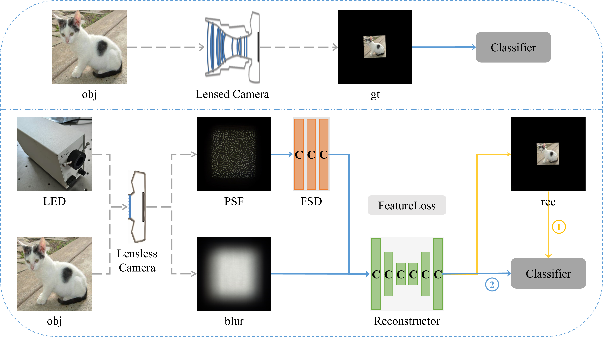
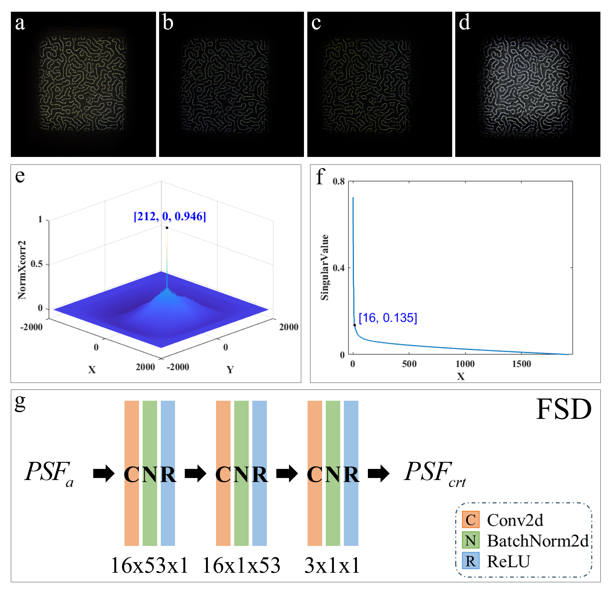
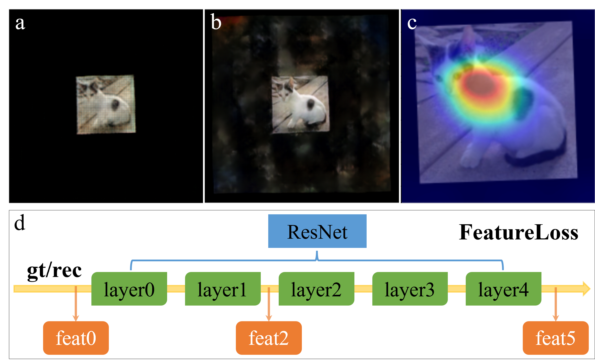

# Enhancing object recognition for lensless cameras through PSF correction and feature loss

PyTorch implementation for the [paper](https://doi.org/10.1016/j.optlastec.2025.113077) "Enhancing object recognition for lensless cameras through PSF correction and feature loss".

## About Article
### Highlights
- A lightweight and interpretable PSF correction network to address model mismatch issues.
- A feature loss function to emphasize the reconstruction of local regions that are critical for recognition.
- A series of incremental network models that integrate physical models and deep learning, achieving high recognition accuracy and good generalization on complex datasets.

### Experimental framework


### PSF correction


### FeatureLoss and local reconstruction


## Setup
- Clone this project using:
```bash
git clone https://github.com/Waller-Lab/LenslessLearning.git
```
- The dependencies can be installed by using:
```bash
conda env create -f environment.yml
```

## Dataset and Pre-trained Model
Wait for uploading!!!

## Citation
If you use this code for your research, please cite our [paper](https://doi.org/10.1016/j.optlastec.2025.113077):
```BibTeX
@article{CHEN2025113077,
title = {Enhancing object recognition for lensless cameras through PSF correction and feature loss},
journal = {Optics & Laser Technology},
volume = {190},
pages = {113077},
year = {2025},
issn = {0030-3992},
doi = {https://doi.org/10.1016/j.optlastec.2025.113077},
url = {https://www.sciencedirect.com/science/article/pii/S0030399225006681},
author = {Kaiyu Chen and Ying Li and Zhengdai Li and Jiangtao Hu and Youming Guo},
keywords = {Lensless, Object recognition, Physics-informed DL, PSF correction, Feature loss},
}
```
